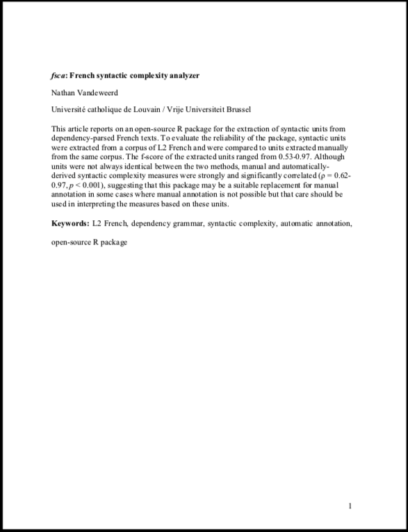
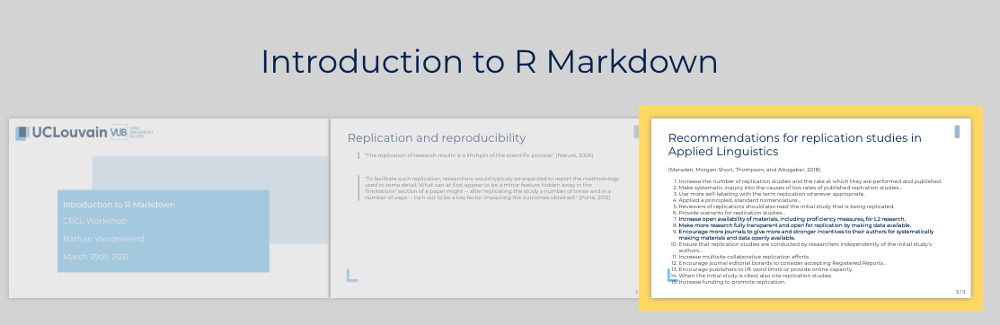
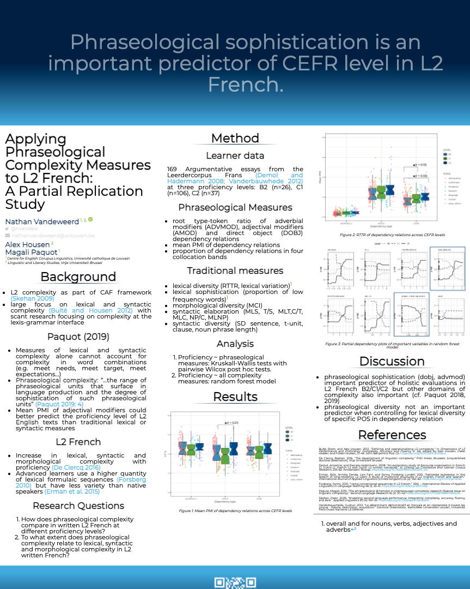
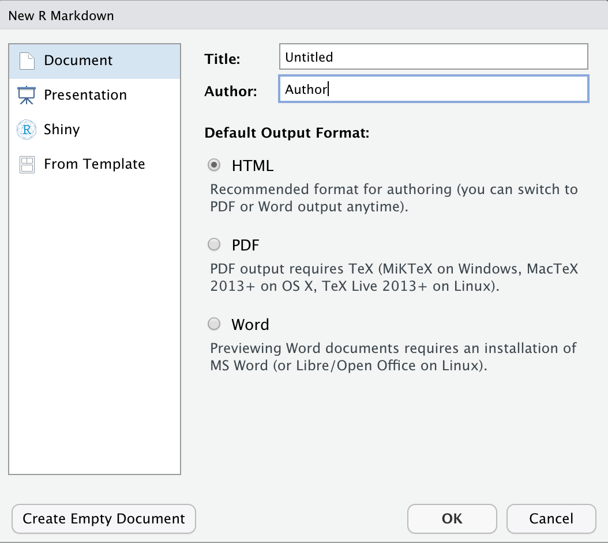
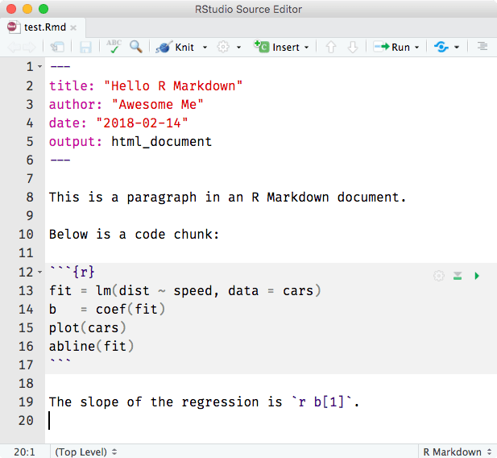
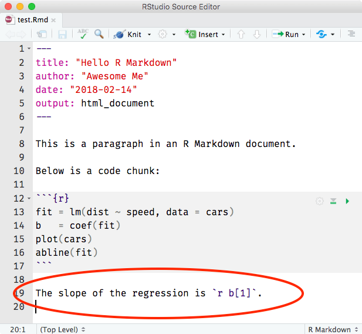
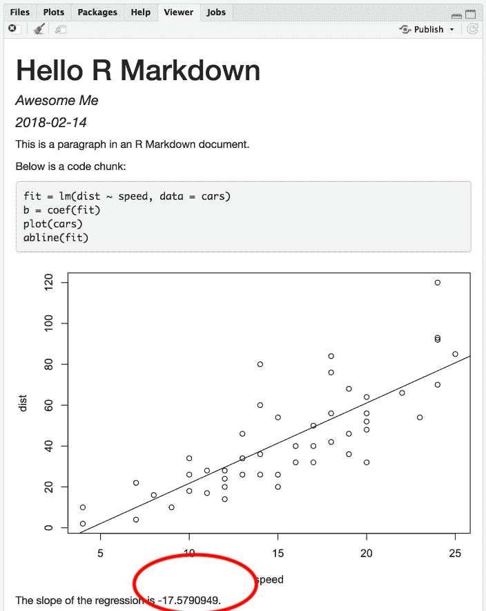
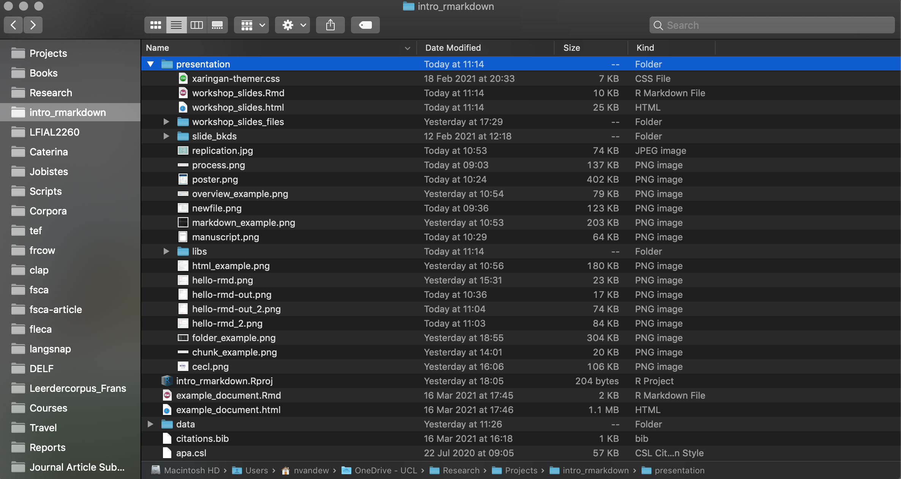
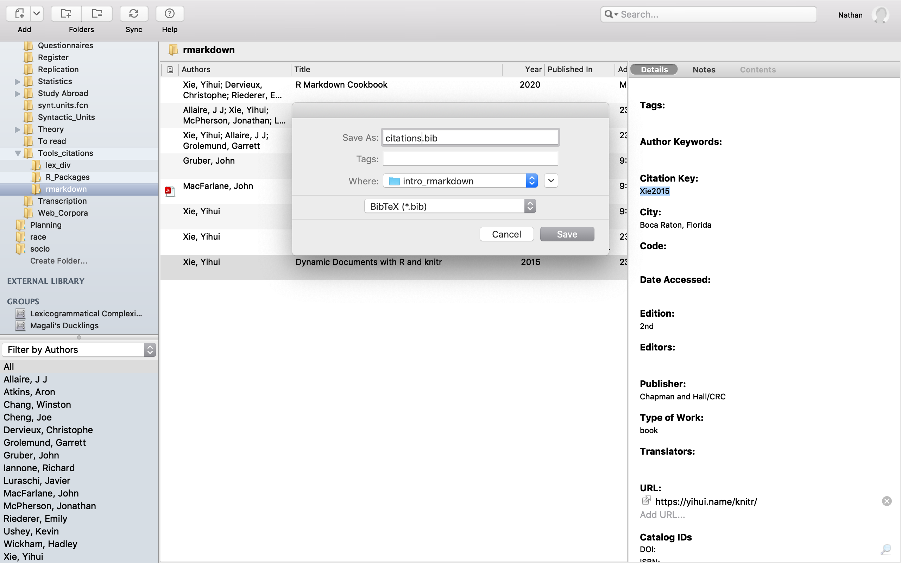
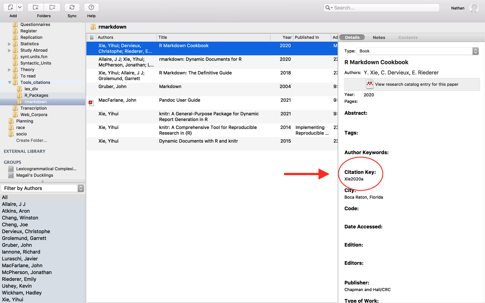

```{r setup, include=FALSE}
options(htmltools.dir.version = FALSE)
knitr::opts_chunk$set(echo = FALSE)
```


```{r load_refs, include=FALSE, cache=FALSE}
library(RefManageR)
BibOptions(check.entries = FALSE,
           bib.style = "authoryear",
           cite.style = "text",
           style = "markdown",
           hyperlink = FALSE,
           dashed = FALSE,
           max.names = 2,
           no.print.fields = c("url"))
bib <- ReadBib("../citations.bib", check = FALSE)
```


```{r xaringanExtra, echo=FALSE}
xaringanExtra::use_xaringan_extra(c("tile_view", "editable"))
```

# Workshop Materials

<br> 

.center[
All workshop materials (including these slides) are available on GitHub:

**https://github.com/nvandeweerd/intro_rmarkdown**
]


<br>
<br>
<br>

```{r, out.width="40%", fig.align='center'}
knitr::include_graphics("github.png")
```


---

# Replication and Reproducibility

> "The replication of research results is a linchpin of the scientific process." `r Citep(bib, c("Nature2006"))`

<br> 

> "To facilitate such replication, researchers would typicaly be expected to **report
the methodology used in some detail**. What can at first appear to be a minor feature hidden away in the "limitations" section of a paper might -- after replicating the study a number of times and in a number of ways -- turn out to be a key factor impacting the outcomes obtained." `r Citep(bib, c("Porte2012"), after = " emphasis added")`

```{r, out.width="30%", fig.align='center'}

```


---

# Recommendations for replication studies in Applied Linguistics

`r Citep(bib, c("Marsden2018"))`
.small[
- Increase the number of replication studies and  the rate at which they are performed and published. 
- Make systematic inquiry into the causes of low rates of published replcation studies...
- Use more self-labeling with the term replication wherever appropriate.
- Apply a principled, standard nomenclature...
- Reviewers of replications should also read the initial study that is being replicated. 
- Provide warrants for replication studies...
]

- **Increase open availability of materials, including proficiency measures, for L2 research.**
- **Make more research fully transparent and open for replication by making data available.**
- **Encourage more journals to give more and stronger incentives to their authors for systematically making materials and data openly available.**

.small[
- Ensure that replication studies are conducted by researchers independently of the initial study's authors...
- Increase multisite collaborative replication efforts. 
- Encourage journal editorial borards to consider accepting Registered Reports... 
- Encourage publishers to lift word limits or provide online capacity. 
- When the initial study is cited, also cite replication studies.
- Increase funding to promote replication.
]


---

# What is R Markdown?

- Markdown `r Citep(bib, c("Gruber2004"))`: mark-up language to convert plain text to HTML
- The `knitr` package: a method for embedding R chunks into markdown documents
- The `pandoc` package: enhances Markdown (adds support for tables, footnotes, math expressions etc.)

<br> 

- The `rmarkdown` package: combines all of the above into a single document format which can be *knit* into various output formats (pdf, HTML, Word, powerpoint etc.)

```{r}

```

---

# Various output files from one R Markdown file

.pull-left[
Word documents

```{r, out.width="55%", fig.align='center'}

```

]


.pull-right[
Presentations

```{r, out.width = "50%", fig.cap = ""}

```

Posters

```{r, out.width = "40%", fig.cap = ""}

```
]

---

# Transparent Analysis


.pull-left[

```{r, include = TRUE, eval = TRUE, echo = TRUE, out.width="40%", fig.cap="", fig.align='center'}
data <- read.csv("../data/stay-abroad.csv") 
data <- data[data$ABROAD == "yes",]
print(head(data))
boxplot(LEX.SOPH ~ BOOKCLUB, data = data, notch = TRUE)

```

]

.pull-right[
```{r, include = TRUE, eval = TRUE, echo = TRUE}
t.test(data$LEX.SOPH ~ data$BOOKCLUB)
```

]

---

# Getting started

.pull-left[
```{r, include = TRUE, eval = FALSE, echo = TRUE}
# Install most recent version
install.packages("rmarkdown")

# Latex engine for PDFs
install.packages("tinytex")

```
In R Studio:

**File >> New File >> R Markdown...**

]

.pull-right[
```{r}

```

]

---

# Anatomy of an R Markdown file

.pull-left[
```{r, out.width="80%",  fig.cap=""}

```

]

.pull-right[

```{r, out.width="60%", fig.align='center'}
knitr::include_graphics("hello-rmd-out.png")
```

]

--

.center[**Did you spot the error?**]

---

# Accountability

.pull-left[
```{r, out.width="80%",  fig.cap=""}

```

]

.pull-right[

```{r, out.width="60%", fig.align='center'}

```

]

---

# Anatomy of an R Markdown file

.pull-left[
```{r, out.width="80%",  fig.cap=""}

```

]

.pull-right[
**YAML Header**

- "YAML Ain't Markup Language"
- Generated automatically when you use wizard
- Contains: 
  - file metadata
  - output format 
  - instructions for **knitting** the document 

**Markdown formatted text**

**Code chunks**

- Three backticks followed by the language (R) in curly brackets


**Inline code**

- A single backtick followed by the language (without curly brackets) 


]

---

# YAML Header

- file metadata: 
  - title, subtitle, author, date, abstract
- output file: 
  - "html\_document"  
  - "pdf\_document" (requires Tex)  
  - "word\_document"  
- instructions for knitting: 
  - styling information (page numbers, table of contents, font size)
  - path to a template document (handy for working with Microsoft Word)
  - path to a citation file (and citation format file)


---

# Markdown formatted text

.small[.pull-left[
- Section headers are marked with hashtags
# \# Level 1
### \## Level 2
#### \## Level 3
- Text surrounded by a single asterisks is *italic*
- Text surrounded by two asterisks is **bold**
- Single dash (-) renders as bullet points
  - item
  - item
- Numbered lists
  1. thing
  2. thing
- hyperlinks: [R Markdown Cheatsheet](https://www.rstudio.org/links/r_markdown_cheat_sheet)
> block quotes 
]]

.pull-right[
```{r, echo =TRUE, eval = FALSE}
- Section headers are marked with hashtags
# Level 1
## Level 2
### Level 3
- Text surrounded by a single asterisks is *italic*
- Text surrounded by two asterisks **bold**
- Single dash (-) renders as bullet points
  - item
  - item
- Numbered lists
  1. thing
  2. thing
- hyperlinks: [R Markdown Cheatsheet](https://www.rstudio.org/links/r_markdown_cheat_sheet)
>block quotes
```


]


---

# Code chunks

- Need to specify the language (r)
- Options can be specified after the language
  - **echo**: should the code be printed? (default = TRUE)
  - **eval:** should the code be run? (default = TRUE)


```{r, echo=FALSE, comment=""}
cat(c("```{r, echo = TRUE, eval = TRUE}",
      "mean(data$LEX.SOPH)",
      "```"), 
    sep='\n')
```

What will this produce in the output document?

--

```{r, echo = TRUE, eval = TRUE}
mean(data$LEX.SOPH)
```

--

.pull-left[

```{r, echo=FALSE, comment=""}
cat(c("```{r, echo = TRUE, eval = FALSE}",
      "mean(data$LEX.SOPH)",
      "```"), 
    sep='\n')
```
]


.pull-right[

```{r, echo=FALSE, comment=""}
cat(c("```{r, echo = FALSE, eval = TRUE, comment = ':):)'}",
      "mean(data$LEX.SOPH)",
      "```"), 
    sep='\n')
```
]

--

.pull-left[
```{r, echo = TRUE, eval = FALSE}
mean(data$LEX.SOPH)
```

]

.pull-right[
```{r, echo = FALSE, eval = TRUE, comment = ":):)"}
mean(data$LEX.SOPH)
```

]

---


# Inserting graphics

```{r, echo=FALSE, comment=""}
cat(c("```{r}",
      "",
      "```"),
    sep='\n')
```

```{r, out.width="50%", fig.cap = ""}

```

---

# Inserting graphics

```{r, echo=FALSE, comment=""}
cat(c("```{r, out.width='10%', fig.cap = 'Figure 1. CECL logo', fig.align='center'}",
      "",
      "```"),
    sep='\n')
```

```{r, out.width='10%', fig.cap = 'Figure 1. CECL logo', fig.align='center'}

```

Options:

- out.width: changes the size of the image
- fig.cap: adds a caption below the image
- fig.align: alignment of the image

---

# A note about file management

- By default the "working directory" of an R Markdown file is the folder where it is located
- File paths (e.g. for images, data) must be specified *relative* to the working directory 
- Easiest to include all necessary files in the same folder as the R Markdown folder
- Also useful to work in "projects" (also see `here` package)

**Note**: An R Markdown document also uses its own "environment" so packages need to be loaded using `library()` in a code chunk **or** explicitly called using double colons 

```{r, out.width="40%", echo = TRUE, fig.align='center'}

```

---
# Tables

How can we turn the raw data frame into a nicely formatted table?

```{r, echo = TRUE}
text.lengths <- read.csv("../data/lsnp.info.csv")
print(text.lengths)
```

---

# Tables

The `kable()` function from the **knitr** package can be used to convert raw data frames to markdown format


```{r, echo=FALSE, comment=""}
cat(c("```{r}",
      "text.lengths <- read.csv('../data/lsnp.info.csv')",
      "knitr::kable(text.lengths, booktabs = TRUE, caption = 'Text lengths by task')",
      "```"), 
    sep='\n')
```


```{r}
text.lengths <- read.csv("../data/lsnp.info.csv")
knitr::kable(text.lengths, booktabs = TRUE, caption = "Text lengths by task")
```

---

# Tables

For more flexibilty (and for non HTML documents), try the `flextable` package

.pull-left[
```{r, echo=FALSE, comment=""}
cat(c("```{r}",
      "library(flextable)",
      "library(magrittr)",
      "text.lengths <- read.csv('../data/lsnp.info.csv')",
      "flextable(text.lengths) %>%",
      "\tbold(part = 'header') %>%",
      "\tbg(i = ~ TASK == 'interview', bg = 'wheat') %>%",
      "\tset_caption('Table 1. Text lengths by task')",
      "```"), 
    sep='\n')
```
]


.pull-right[
```{r}
library(flextable)
library(magrittr)
text.lengths <- read.csv("../data/lsnp.info.csv")
flextable(text.lengths) %>%
  bold(part = 'header') %>%
  bg(i = ~ TASK == 'interview', bg = 'wheat') %>%
  set_caption('Table 1. Text lengths by task')
```

]

---

# Citations

In order to include citations, you first need to add two lines to the YAML header:

- a path to a **.bib** file containing citations in Bibtex format (can be exported from Mendeley or Zotero)
- a path to a **.csl** file containing citation formatting style guidelines (can be downloaded from the [Zotero Style Repository](https://www.zotero.org/styles?q=apa))
- easiest if you store both of these in the same folder as the R Markdown file

.pull-left[
```{r, echo = TRUE, eval=FALSE}
---
title: "Introduction to R Markdown"
author: "Nathan Vandeweerd"
date: "`r Sys.Date()`"
output: html_document
*bibliography: citations.bib
*csl: apa.csl
---
```
]

.pull-right[
```{r, out.width="90%"}

```
]


---

# Citations

Once you have linked to a **.bib** file and a **.csl** file, you can include in-text citations using the format below:
- Multiple citations can be separated with a semi-colon
- A minus sign (-) means that only the year will be included 

\[@CitationKey1; @CitationKey2\] --> (Author, 2005; Author, 2006)  
\[-@CitationKey1\] --> (2005)

.pull-left[

The Citation Key is **generated automatically** by reference tools such as Mendeley and Zotero (though you may need to change the settings to make it visible).

A bibliography will automatically be included at the end of the document which contains all of the cited references. To turn this off, simply add `suppress-bibliography: true` to the YAML header.

]
 

```{r, out.width="40%", fig.align='center'}

```

---

# Practice

.small[
1. Download the following files from GitHub (remember to save them all in the same folder): 
- `example_document.Rmd`
- `apa.csl`
- `citations.bib`
- `cecl.png`
- `lsnp.info.csv`
2. To do: 
- make section headers: 
  - abstract (first level)
  - topics covered (second level)
- make bullet points for the topics covered
- add a code chunk that calculates 1+1 (show both the code and the result)
- add inline code that calculates 1+1
- add the CECL Logo (in a reasonable size)
- add a table showing the lengths of the langsnap texts by task (`lsnp.info.csv`)
- add a barplot (`barplot()`) of the same data
- add a hyperlink to the R Markdown webpage
- make the second paragraph a block quote
- add the citations for the R Markdown package
]


# Useful packages

Some other useful packages: 

- `knitr` (included with rmarkdown package): working with code chunks, inserting graphics, rendering basic tables
- `officer` and `officedown`: for working with Microsoft Office
- `xaringen`: for HTML presentations (like this one)
- `flextable`: more customizable tables
- `bookdown`: for long documents (i.e. dissertations)


